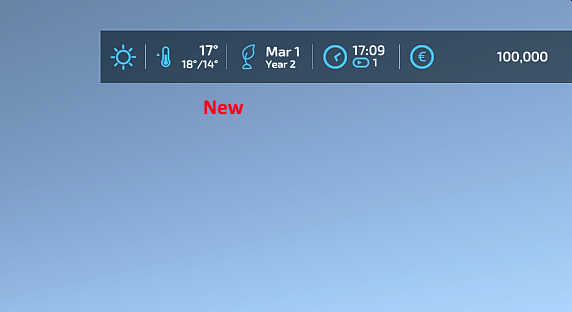

# FS22_ExtendedGameInfoDisplay

Expands the current GameInfoDisplay in the upper right corner by displaying the current year under the date and activates a hidden temperature feature with an indicator of whether the temperature is falling, staying constant or rising, the display of the current temperature and the min/max temperature of the day.

## Credits
* Woeller ([Youtube](https://www.youtube.com/@woeller))
* Sqeep

## Copyright
Copyright (c) 2023 [Dennis Schmitt](https://github.com/Peppie23).
All rights reserved.
